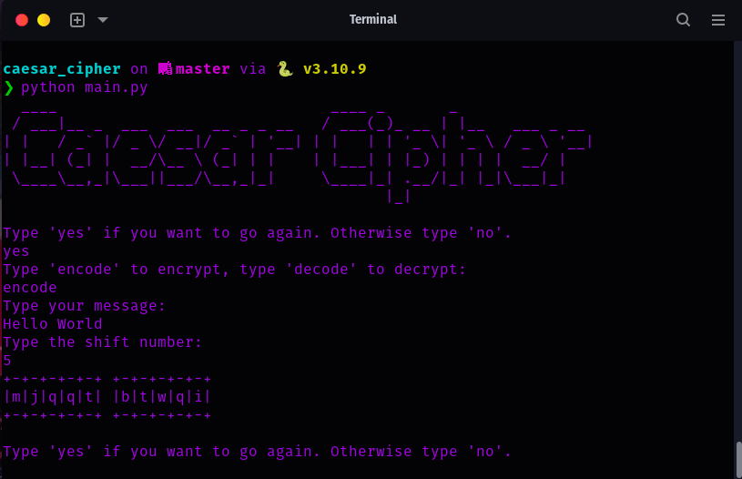

# Caesar Cipher Encoder/Decoder with ASCII Art Display

A visually engaging Python-based tool that allows users to encode or decode texts using the Caesar cipher method and displays the results in a captivating ASCII art format.

## Usage

1. Run the script.
2. You'll be greeted with the "Caesar" logo in ASCII art.
3. You will be prompted to choose between encoding or decoding a message.
4. Input your desired message.
5. Input the shift number for the cipher.
6. View the encoded or decoded result in a stunning "digital" ASCII art format!

## Features

- Simple and intuitive user interface.
- Support for encoding and decoding.
- Continuous operation until the user decides to exit.
- Visually appealing ASCII art display for both the logo and results using the `pyfiglet` library.

## Dependencies

- `pyfiglet`: Required for generating the ASCII art. Use the "digital" font for optimal readability.

## Installation

To use this tool, ensure you have `pyfiglet` installed:
1. Clone the repository:
   ```
   git clone https://github.com/j-breedlove/caesar_cipher.git
   ```
2. Navigate to the project directory:
   ```
   cd caesar_cipher
   ```
3. Create environment and Install required packages:
   ```
   pip install pipenv
   pipenv install
   pipenv shell
   pipenv install pyfiglet
   ```
4. Run the application:
   ```
   python main.py
   ```
